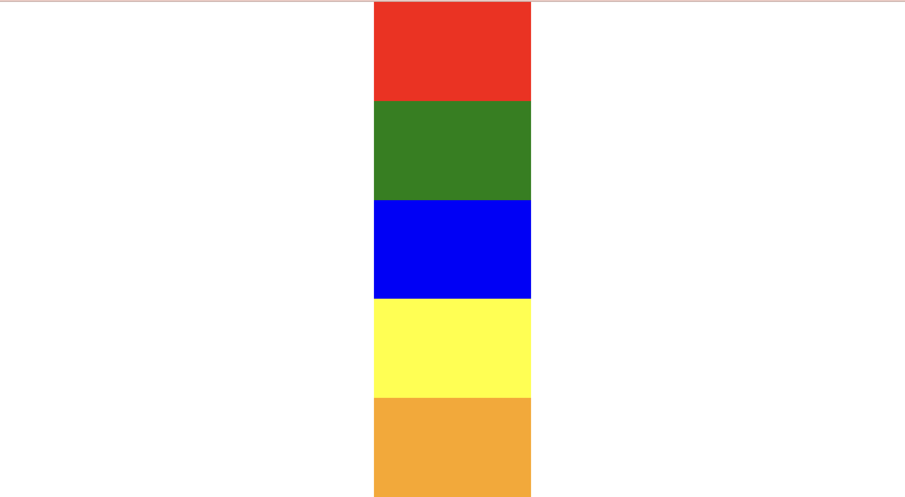

# Додатково 2

Зробити макет як на сторінці

**Вимоги до завдання:**

1. Створити 5 блоків на сторінці з однаковою висотою використовуючи div
   1. Усі блоки повинні мати загальний клас block
   2. Висота блоків 20vh
   3. Вирівняти блоки по центру екрану
2. Кожен блок повинен мати ще один клас за допомогою якого буде додано колір для блока (клас повинен називатися відповідно до кольору)
3. Добавити ховер ефект на блок https://www.w3schools.com/cssref/sel_hover.asp
   1. На ховер висота блоку повинна збільшуватися до 30vh

**ВАЖЛИВО:**

Повністю вся стилізація повинна відбуватися за допомогою класів